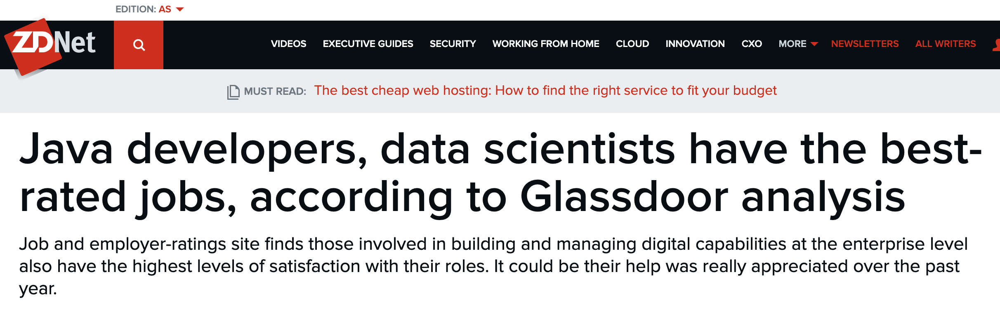
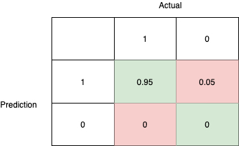

Data Science End to End: From data wrangling to machine learning to model deployment as micro-service API
=========================================================================================================

 

Azrul Hasni MADISA

February 2021

 

 

The art of data science
-----------------------

Data science is one of those fields where you need to master a few disciplines
to get good at it. From statistics, to machine learning, to data engineering, to
software development, to business. In order to successfully deliver a data
science project, we need a team of not just data scientists, but also software
developers, data engineers, business analysts and architects. Just looking at
the data and AI landscape (2020) below shows how mind-boggling data science is.

 

 

The need to combine these different disciplines would mean mixing and matching
all sorts of disciplines, tools and techniques. In this regard, data science
seems to be closer to art than science.

 

In this series of article, we would walk through some aspects of data science
end to end. Of course I do not pretend to master all aspects of data science,
nor do I claim that what I would write is the one true way of data science, nor
that what I propose here is complete and flawless. Rather, I would like to help
highlight how data science could work in an end to end manner. Starting from
(some form of) data wrangling, to machine learning, to model deployment and API
development, we will explore together the tools and mindset of data science end
to end.

 

Why write about this
--------------------

Well, this appeared in my news feed a few days ago:

Both Java developers and data scientists have the best rated job - so, why don’t
we combine those together and created the best of the best rated article -
talking about data science at the beginning, and continue with Java development
towards the end :)

 

 

The business problem
--------------------

Database a science is applied in many ways with many different workflows. In
this article, we are going to focus on one : credit lifecycle - i.e. the usage
of machine learning to determine the risk of a loan. Hopefully what is presented
here is generic enough for you to use it in your own endeavour and use cases.

 

### Credit life-cycle redux\* 101

Have you ever applied for a loan from a bank? If you do, you will notice that
the bank would need to do a “credit check” on you to determine the risk related
to giving you said loan. How would a bank determine this risk? Welcome to credit
life-cycle redux 101!

 

Credit lifecycle represents steps that a loan goes through from creation to
completion.

1.  When a customer applies for a loan, the application is captured by a Loan
    Origination System (LOS). The LOS will use the bank’s internal data about
    the customer (if any - the customer could be totally new to the bank, so no
    internal data on the customer) or data from a credit bureau (in Malaysia, we
    have several credit bureaux such as Experian, CTOS and CCRIS).

2.  This data is then sent to a score card. The score card will determine the
    level of risk this customer have vis-a-vis the loan he is requesting. Once
    the score has been determined, the customer would be either accepted or
    rejected.

3.  If the customer is accepted and the loan is disbursed, the customer would
    need to start paying back his or her instalments. This is captured by a Loan
    Account System.

4.  As the customer pays the loan, her credit behaviour is captured by the Loan
    Account System. This data is then conveyed to the data warehouse.

5.  A data scientist would access this behaviour data and use magical machine
    learning algorithms to come up with a machine learning model.

6.  This model is then delivered to the software development team. They will
    then create a score card combining the ML model with a whole bunch of other
    rules (for example, someone younger than 18 should not be allowed to apply
    for a loan). The scorecard is then packaged as a micro-service with API and
    deployed back. The LOS will now have an updated score card to call for the
    next set of customers.

 

 

\* Why redux? Because this is not the complete credit lifecycle. We are
excluding Collections , Portfolio management, Underwriting etc.

 

Objective
---------

Our objective is to walk through part of the credit lifecycle

1.  We will use data to to build a machine learning model. We will walk through
    some of the decision points and that a typical data scientist would have to
    make - especially around data wrangling. These decision points will
    determine the quality of our machine learning model

2.  The data that we have is the data of accepted loan applications. Despite our
    acceptance, the loan could run into problems. When they do, we will learn
    from the behaviour of said loan and prevent future loans with the same
    characteristics to be onboarded in the first place.

3.  We will then look at how this machine learning model will be deployed as an
    API. We will explore some tools and techniques here.

4.  Last but not least, we will test the API to make a few credit scoring
    decision. We will also put the model under performance test to see how it
    fares under load

 

Tools
-----

As we said before, there are a plethora of tools out there to achieve our
objectives. For this article we will use the following. Do note that, even if
you do not use the tools below, the techniques presented are technology neutral
enough that you will find its equivalent in your favourite platform:

 

-   Data wrangling and machine learning analytics: R and RStudio

-   Machine learning interchange format: PMML

-   Micro services development: Java + Spring Boot + JPMML

-   Deployment: Docker on Kubernetes

-   Performance test: JMeter

 

### Directory

This is the organisation of our directory

\$PROJECTS

\|- E2E_ML

\|- scorecard

 

All our R source code will be in E2E_ML directory. The directory ’scorecard’ is
where we will put our Java Spring Boot project.

 

### Installing R and RStudio

-   On a Mac, we can just use home-brew. Fire up a command line console and type

~~~~~~~~~~~~~~~~~~~~~~~~~~~~~~~~~~~~~~~~~~~~~~~~~~~~~~~~~~~~~~~~~~~~~~~~~~~~~~~~
> brew install r
~~~~~~~~~~~~~~~~~~~~~~~~~~~~~~~~~~~~~~~~~~~~~~~~~~~~~~~~~~~~~~~~~~~~~~~~~~~~~~~~

-   For other platforms, please refer to the docs
    <https://cran.r-project.org/doc/manuals/r-release/R-admin.html>

-   Next, we will install RStudio - basically a GUI tool for R. Visit the page
    <https://rstudio.com/products/rstudio/download/>, download RStudio Desktop
    and install the binary

-   Launch RStudio and you will see the interface below:

-   From the top menu, choose Session \> Set Working Directory \> Choose
    Directory… .Then choose \$PROJECTS/E2E_ML directory

 

### Installing R packages

-   From time to time, you will need to export new library through the command
    `library()`. E.g.

~~~~~~~~~~~~~~~~~~~~~~~~~~~~~~~~~~~~~~~~~~~~~~~~~~~~~~~~~~~~~~~~~~~~~~~~~~~~~~~~
    library(sos)
~~~~~~~~~~~~~~~~~~~~~~~~~~~~~~~~~~~~~~~~~~~~~~~~~~~~~~~~~~~~~~~~~~~~~~~~~~~~~~~~

-   You might encounter the error below

~~~~~~~~~~~~~~~~~~~~~~~~~~~~~~~~~~~~~~~~~~~~~~~~~~~~~~~~~~~~~~~~~~~~~~~~~~~~~~~~
> Error in library(sos) : there is no package called ‘sos’
~~~~~~~~~~~~~~~~~~~~~~~~~~~~~~~~~~~~~~~~~~~~~~~~~~~~~~~~~~~~~~~~~~~~~~~~~~~~~~~~

-   Firstly, check if it is a typo :) . If not, you probably do not have the
    package. So lets learn how to install packages. On RStudio console, just use
    the command `install.packages()`. E.g.

~~~~~~~~~~~~~~~~~~~~~~~~~~~~~~~~~~~~~~~~~~~~~~~~~~~~~~~~~~~~~~~~~~~~~~~~~~~~~~~~
> install.packages("sos")
~~~~~~~~~~~~~~~~~~~~~~~~~~~~~~~~~~~~~~~~~~~~~~~~~~~~~~~~~~~~~~~~~~~~~~~~~~~~~~~~

and you are good to go

 

How machine learning works
--------------------------

Before we deep dive into all this, let us see how machine learning works. In
fact, there are 3 types of machine learning:

1.  supervised learning - we supply examples (called training data) to an
    algorithm, and the algorithm build a machine learning model that generalised
    from the examples.

2.  unsupervised learning - the machine learning algorithm learn from an
    inherent property of the data and generalised from that

3.  reinforcement learning - the machine learning algorithm learn as it goes

 

We will use supervised learning in this article. Supervised learning is
demonstrated below. We have 2 phases: a training phase and a testing phase
(there is usually a validation phase that will be used for model sign off by
business owners / product owners - we will ignore this phase for now)

 

In the training phase, a whole bunch of examples are shown to the training
algorithm. The algorithm will create a model that will generalise knowledge from
these examples. The training data usually has the “feature” (or features) part
that contains the object to be trained on, and label - i.e. the decision that
the algorithm must generalised from.

 

In the testing phase, the generalised machine learning model is being used
against training data. The training data is split into features and labels.
Features are fed into the model - the model would then make a decision, the
decision is then compared to the actual label. If the generalisation works, then
the result will be comparable got the label., In the example below, even if the
model had never seen a bitten apple before, the color and features of the apple
is enough for it to make a good guess.

 

Of course, the algorithm could make mistakes. If so, we would need to tweak the
parameters of the training and retest our machine learning model.

 

 

Data loading and wrangling
--------------------------

-   Recall our credit lifecycle earlier. Data wrangling is the first step

 

-   A machine learning exercise will always start with data. So lets get our
    hands on some real world loan data. Of course, no bank would share their
    data with us but we do have some peer-to-peer lending outfit out there who
    is willing to share (at least once upon a time)

-   Point your browser to Kaggle’s lending club data page
    [<https://www.kaggle.com/wordsforthewise/lending-club>] and download the
    accepted_2007_to_2018Q4.csv.gz file and put it in the \$PROJECTS/E2E_ML
    folder.

 

### Important notes on R

-   Note that some of the algorithms here will take time to complete. If you
    wish to continue the tutorial while skipping the more time consuming steps,
    you can use some intermediary data here
    <https://github.com/azrulhasni/E2E_ML/blob/main/intermediary_data.RData>.

-   If you want to follow the article by running the R commands, all the
    commands here are collected in one big script
    <https://github.com/azrulhasni/E2E_ML/blob/main/defaultmodeler_allcommands.R>

 

### Notation used

-   In this article, when we are running some R command on the RStudio console,
    we will express it as below

~~~~~~~~~~~~~~~~~~~~~~~~~~~~~~~~~~~~~~~~~~~~~~~~~~~~~~~~~~~~~~~~~~~~~~~~~~~~~~~~
> some_R_command(...)
~~~~~~~~~~~~~~~~~~~~~~~~~~~~~~~~~~~~~~~~~~~~~~~~~~~~~~~~~~~~~~~~~~~~~~~~~~~~~~~~

-   What comes after the command (usually starts with [1]) is the out put of the
    command

~~~~~~~~~~~~~~~~~~~~~~~~~~~~~~~~~~~~~~~~~~~~~~~~~~~~~~~~~~~~~~~~~~~~~~~~~~~~~~~~
> some_R_command(...)

[1] Result of some_R_command(...)
~~~~~~~~~~~~~~~~~~~~~~~~~~~~~~~~~~~~~~~~~~~~~~~~~~~~~~~~~~~~~~~~~~~~~~~~~~~~~~~~

-   Comments are designated as proceeding with a hash

~~~~~~~~~~~~~~~~~~~~~~~~~~~~~~~~~~~~~~~~~~~~~~~~~~~~~~~~~~~~~~~~~~~~~~~~~~~~~~~~
> some_R_command(...) #some comment

[1] Result of some_R_command(...)
~~~~~~~~~~~~~~~~~~~~~~~~~~~~~~~~~~~~~~~~~~~~~~~~~~~~~~~~~~~~~~~~~~~~~~~~~~~~~~~~

-   Some commands will take multiple lines, new lines for the same command will
    be designated with a + symbol

~~~~~~~~~~~~~~~~~~~~~~~~~~~~~~~~~~~~~~~~~~~~~~~~~~~~~~~~~~~~~~~~~~~~~~~~~~~~~~~~
> some_R_long_command(
+  ...
+  ...
+)
[1] Result of some_R_command(...)
~~~~~~~~~~~~~~~~~~~~~~~~~~~~~~~~~~~~~~~~~~~~~~~~~~~~~~~~~~~~~~~~~~~~~~~~~~~~~~~~

-   Example:

~~~~~~~~~~~~~~~~~~~~~~~~~~~~~~~~~~~~~~~~~~~~~~~~~~~~~~~~~~~~~~~~~~~~~~~~~~~~~~~~
> 5-3 #this is what we type. The result is below
[1] 2
~~~~~~~~~~~~~~~~~~~~~~~~~~~~~~~~~~~~~~~~~~~~~~~~~~~~~~~~~~~~~~~~~~~~~~~~~~~~~~~~

 

 

### Inspecting our data

-   Firstly, we need to load the csv file we downloaded into R. In RStudio
    console type:

~~~~~~~~~~~~~~~~~~~~~~~~~~~~~~~~~~~~~~~~~~~~~~~~~~~~~~~~~~~~~~~~~~~~~~~~~~~~~~~~
> accepted_2007_to_2018Q4 <- read_csv("accepted_2007_to_2018Q4.csv")
~~~~~~~~~~~~~~~~~~~~~~~~~~~~~~~~~~~~~~~~~~~~~~~~~~~~~~~~~~~~~~~~~~~~~~~~~~~~~~~~

-   It will take a while to load since the file is huge. Once done you will have
    the variable `accepted_2007_to_2018Q4` representing the data in the csv file

-   To see all the columns, use the `spec()` function:

~~~~~~~~~~~~~~~~~~~~~~~~~~~~~~~~~~~~~~~~~~~~~~~~~~~~~~~~~~~~~~~~~~~~~~~~~~~~~~~~
> spec(accepted_2007_to_2018Q4)

[1] cols(
  id = col_double(),
  member_id = col_logical(),
  loan_amnt = col_double(),
  funded_amnt = col_double(),
  funded_amnt_inv = col_double(),
  term = col_character(),
  int_rate = col_double(),
  installment = col_double(),
  grade = col_character(),
...
  settlement_percentage = col_double(),
  settlement_term = col_double()
)
~~~~~~~~~~~~~~~~~~~~~~~~~~~~~~~~~~~~~~~~~~~~~~~~~~~~~~~~~~~~~~~~~~~~~~~~~~~~~~~~

-   To find the number of rows, use `nrow()`. To find the number of columns use
    `ncol()`.

~~~~~~~~~~~~~~~~~~~~~~~~~~~~~~~~~~~~~~~~~~~~~~~~~~~~~~~~~~~~~~~~~~~~~~~~~~~~~~~~
> nrow(accepted_2007_to_2018Q4)
[1] 2260701
> ncol(accepted_2007_to_2018Q4)
[1] 151
~~~~~~~~~~~~~~~~~~~~~~~~~~~~~~~~~~~~~~~~~~~~~~~~~~~~~~~~~~~~~~~~~~~~~~~~~~~~~~~~

-   There are 151 columns. To do machine learning on all these columns is going
    to be challenging and time consuming. Let us see if we can reduce the
    number. Firstly, some house-keeping

-   Let us make a copy of `accepted_2007_to_2018AQ4`

~~~~~~~~~~~~~~~~~~~~~~~~~~~~~~~~~~~~~~~~~~~~~~~~~~~~~~~~~~~~~~~~~~~~~~~~~~~~~~~~
> data<-accepted_2007_to_2018Q4 #make a copy first
~~~~~~~~~~~~~~~~~~~~~~~~~~~~~~~~~~~~~~~~~~~~~~~~~~~~~~~~~~~~~~~~~~~~~~~~~~~~~~~~

-   **From here forth, we will work on the variable data instead of
    accepted_2007_to_2018Q4**

-   Notice that the first column is an id. Which suggest it is an identifier of
    some sort. Let see if it is. Let us count the unique elements in id. Lets us
    also see if there are empty values in id

~~~~~~~~~~~~~~~~~~~~~~~~~~~~~~~~~~~~~~~~~~~~~~~~~~~~~~~~~~~~~~~~~~~~~~~~~~~~~~~~
> length(unique(data$id)) #how many unique ids (including NA - the empty value)
[1] 2260669

> nrow(filter(data,is.na(id))) #are there any empty ids
[1] 33
~~~~~~~~~~~~~~~~~~~~~~~~~~~~~~~~~~~~~~~~~~~~~~~~~~~~~~~~~~~~~~~~~~~~~~~~~~~~~~~~

-   So there are 2260669 unique ids. 2260669-1+33=2260701 - the total number (-1
    here is to exclude the NA value, yes, the length() function also count NA as
    an element)

-   Some ids are null, this could mean that those data points are some sort of
    error. Let us take them out of our training data

~~~~~~~~~~~~~~~~~~~~~~~~~~~~~~~~~~~~~~~~~~~~~~~~~~~~~~~~~~~~~~~~~~~~~~~~~~~~~~~~
> data<-filter(data,!is.na(id)) #only keep data that has a proper id
> nrow(data)#count the number of rows of data again just to be sure
[1] 2260668
~~~~~~~~~~~~~~~~~~~~~~~~~~~~~~~~~~~~~~~~~~~~~~~~~~~~~~~~~~~~~~~~~~~~~~~~~~~~~~~~

 

 

### Features and label

-   Upon inspection of the columns, we see that the status of the loans can be
    found in the column loan_status. This column will tell us if the loans are
    good or bad. Listing out the possible values of that column, we will have:

~~~~~~~~~~~~~~~~~~~~~~~~~~~~~~~~~~~~~~~~~~~~~~~~~~~~~~~~~~~~~~~~~~~~~~~~~~~~~~~~
> unique(data$loan_status)
 [1] "Fully Paid"                                         
 [2] "Current"                                            
 [3] "Charged Off"                                        
 [4] "In Grace Period"                                    
 [5] "Late (31-120 days)"                                 
 [6] "Late (16-30 days)"                                  
 [7] "Default"                                            
 [8] NA                                                   
 [9] "Does not meet the credit policy. Status:Fully Paid" 
[10] "Does not meet the credit policy. Status:Charged Off"
~~~~~~~~~~~~~~~~~~~~~~~~~~~~~~~~~~~~~~~~~~~~~~~~~~~~~~~~~~~~~~~~~~~~~~~~~~~~~~~~

-   So, we will consider "Fully Paid”, "Does not meet the credit policy.
    Status:Fully Paid" and “Current" as good and the rest as bad.

~~~~~~~~~~~~~~~~~~~~~~~~~~~~~~~~~~~~~~~~~~~~~~~~~~~~~~~~~~~~~~~~~~~~~~~~~~~~~~~~
> t1<-data$loan_status[]=="Current"|data$loan_status[]=="Fully Paid"|data$loan_status[]=="Does not meet the credit policy. Status:Charged Off"  

> data$target<-t1 #create a new column called target. Target is now a logical (boolean) column  

> data<-subset(data, select=-c(loan_status)) #take out loan_status as it will interfere with learning
~~~~~~~~~~~~~~~~~~~~~~~~~~~~~~~~~~~~~~~~~~~~~~~~~~~~~~~~~~~~~~~~~~~~~~~~~~~~~~~~

-   As you can see, we introduce a new column called target which contains TRUE
    or FALSE - representing good or bad loan respectively

 

 

### Taking out unique columns

-   If the column is unique for every row, we can not generalised from it - so
    it is useless in machine learning. Note, we will still keep the column id
    we’ve encountered before even if it has no impact to learning - this is just
    so that we can refer to the rows uniquely

-   Firstly, load the dplyr library

~~~~~~~~~~~~~~~~~~~~~~~~~~~~~~~~~~~~~~~~~~~~~~~~~~~~~~~~~~~~~~~~~~~~~~~~~~~~~~~~
> library(dplyr)
~~~~~~~~~~~~~~~~~~~~~~~~~~~~~~~~~~~~~~~~~~~~~~~~~~~~~~~~~~~~~~~~~~~~~~~~~~~~~~~~

-   Run the commands below

~~~~~~~~~~~~~~~~~~~~~~~~~~~~~~~~~~~~~~~~~~~~~~~~~~~~~~~~~~~~~~~~~~~~~~~~~~~~~~~~
> c <- data %>% summarise_all(n_distinct)
> str(c)
~~~~~~~~~~~~~~~~~~~~~~~~~~~~~~~~~~~~~~~~~~~~~~~~~~~~~~~~~~~~~~~~~~~~~~~~~~~~~~~~

-   You will then see the number of distinct values per column. Let see if there
    are columns that matches the number of id

~~~~~~~~~~~~~~~~~~~~~~~~~~~~~~~~~~~~~~~~~~~~~~~~~~~~~~~~~~~~~~~~~~~~~~~~~~~~~~~~
> which(c==length(unique(data$id)))
[1]  1 19
~~~~~~~~~~~~~~~~~~~~~~~~~~~~~~~~~~~~~~~~~~~~~~~~~~~~~~~~~~~~~~~~~~~~~~~~~~~~~~~~

-   OK, so column 19 (url) is unique. It make sense that each data point (i.e. a
    loan) has its own url. We can then delete this column without much problem.

~~~~~~~~~~~~~~~~~~~~~~~~~~~~~~~~~~~~~~~~~~~~~~~~~~~~~~~~~~~~~~~~~~~~~~~~~~~~~~~~
> data<-subset(data, select=-c(url))
~~~~~~~~~~~~~~~~~~~~~~~~~~~~~~~~~~~~~~~~~~~~~~~~~~~~~~~~~~~~~~~~~~~~~~~~~~~~~~~~

 

 

### Taking out columns with only the same value throughout

-   Obviously if the column has the same value for every row, we cannot learn
    much from it. To determine this we use the command below. Note that this
    command will also root out columns that are empty throughout.

~~~~~~~~~~~~~~~~~~~~~~~~~~~~~~~~~~~~~~~~~~~~~~~~~~~~~~~~~~~~~~~~~~~~~~~~~~~~~~~~
> c <- sapply(data,function(x) length(unique(x))==1)
> d <- names(which(c==TRUE))
> print(d)

 [1] "member_id"                           "desc"                               
 [3] "revol_bal_joint"                     "sec_app_fico_range_low"             
 [5] "sec_app_fico_range_high"             "sec_app_earliest_cr_line"           
 [7] "sec_app_inq_last_6mths"              "sec_app_mort_acc"                   
 [9] "sec_app_open_acc"                    "sec_app_revol_util"                 
[11] "sec_app_open_act_il"                 "sec_app_num_rev_accts"              
[13] "sec_app_chargeoff_within_12_mths"    "sec_app_collections_12_mths_ex_med" 
[15] "sec_app_mths_since_last_major_derog"
~~~~~~~~~~~~~~~~~~~~~~~~~~~~~~~~~~~~~~~~~~~~~~~~~~~~~~~~~~~~~~~~~~~~~~~~~~~~~~~~

-   The variable `d` contains the list of columns we should delete.

~~~~~~~~~~~~~~~~~~~~~~~~~~~~~~~~~~~~~~~~~~~~~~~~~~~~~~~~~~~~~~~~~~~~~~~~~~~~~~~~
> data <- data[, !colnames(data) %in% d]
~~~~~~~~~~~~~~~~~~~~~~~~~~~~~~~~~~~~~~~~~~~~~~~~~~~~~~~~~~~~~~~~~~~~~~~~~~~~~~~~

-   We are now left with 135 columns. Still a lot

###  

### Feature selection

-   Features are data (columns rather) used by a machine learning model to make
    a decision (please refer to the paragraph How Machine Learning Works)

-   Some features (i.e. columns) are not useful for our model training. This is
    because they do not generalised properly to contribute to the overall
    decision. Selecting the right features is important because the complexity
    (and duration) of our training will depend on how many features we accept as
    part of our training data

-   The work to reduce features (i.e. columns) is called feature selection. In
    this article we will take a look at one of them. You may want to visit
    <https://www.machinelearningplus.com/machine-learning/feature-selection/>
    for other varieties of feature selection techniques and libraries

-   We will use the Boruta method. The explanation of how Boruta method works is
    beyond the scope of this article but a good explanation can be found here
    <https://towardsdatascience.com/boruta-explained-the-way-i-wish-someone-explained-it-to-me-4489d70e154a>

-   Before we start Boruta, we need to manipulate our data a bit - this is
    because Boruta cannot handle null values. So we need to, in a copy, delete
    all columns that has at least 60% null values. With what is left, we delete
    rows containing null values.

~~~~~~~~~~~~~~~~~~~~~~~~~~~~~~~~~~~~~~~~~~~~~~~~~~~~~~~~~~~~~~~~~~~~~~~~~~~~~~~~
> fna<-as.data.frame(freq.na(data)) #find the frequency of empty data
> a<-fna[fna$'%'<60,] #get the columns that is at least 60% not null

> b<-data[, colnames(data) %in% rownames(a)] #filter out columns with 60% or > nulls
> data4boruta <- na.omit(b) #delete any row with null in it
~~~~~~~~~~~~~~~~~~~~~~~~~~~~~~~~~~~~~~~~~~~~~~~~~~~~~~~~~~~~~~~~~~~~~~~~~~~~~~~~

-   Boruta will take a long time to run, so we cannot put all our data to it.
    Rather, we would take a sample and train Boruta with that sample. Note, even
    at 60000 rows of data, Boruta might still take half a day to complete

~~~~~~~~~~~~~~~~~~~~~~~~~~~~~~~~~~~~~~~~~~~~~~~~~~~~~~~~~~~~~~~~~~~~~~~~~~~~~~~~
> smplddata <- data4boruta[sample(nrow(data4boruta), 60000), ]  #sample 
~~~~~~~~~~~~~~~~~~~~~~~~~~~~~~~~~~~~~~~~~~~~~~~~~~~~~~~~~~~~~~~~~~~~~~~~~~~~~~~~

-   We then train Boruta with the sampled copy of our data. Note that Boruta
    will take a while to complete. If you want to skip this step, please use the
    intermediary data here
    <https://github.com/azrulhasni/E2E_ML/blob/main/intermediary_data.RData>

~~~~~~~~~~~~~~~~~~~~~~~~~~~~~~~~~~~~~~~~~~~~~~~~~~~~~~~~~~~~~~~~~~~~~~~~~~~~~~~~
> boruta_output <- Boruta(target ~ ., data=smplddata, doTrace=2, maxRuns=20)   
  
> boruta_signif <- getSelectedAttributes(boruta_output, withTentative = FALSE)  

> print(boruta_signif) 
 [1] "id"                         "loan_amnt"                 
 [3] "funded_amnt"                "funded_amnt_inv"           
 [5] "term"                       "int_rate"                  
 [7] "installment"                "grade"                     
 [9] "sub_grade"                  "annual_inc"                
[11] "issue_d"                    "pymnt_plan"                
[13] "dti"                        "fico_range_low"            
[15] "fico_range_high"            "open_acc"                  
[17] "revol_bal"                  "revol_util"                
[19] "total_acc"                  "out_prncp"                 
[21] "out_prncp_inv"              "total_pymnt"               
[23] "total_pymnt_inv"            "total_rec_prncp"           
[25] "total_rec_int"              "total_rec_late_fee"        
[27] "recoveries"                 "collection_recovery_fee"   
[29] "last_pymnt_d"               "last_pymnt_amnt"           
[31] "last_credit_pull_d"         "last_fico_range_high"      
[33] "last_fico_range_low"        "application_type"          
[35] "tot_cur_bal"                "open_acc_6m"               
[37] "open_act_il"                "open_il_24m"               
[39] "total_bal_il"               "il_util"                   
[41] "open_rv_12m"                "open_rv_24m"               
[43] "max_bal_bc"                 "all_util"                  
[45] "total_rev_hi_lim"           "acc_open_past_24mths"      
[47] "avg_cur_bal"                "bc_open_to_buy"            
[49] "bc_util"                    "mo_sin_old_rev_tl_op"      
[51] "mo_sin_rcnt_rev_tl_op"      "mo_sin_rcnt_tl"            
[53] "mort_acc"                   "mths_since_recent_bc"      
[55] "num_actv_bc_tl"             "num_actv_rev_tl"           
[57] "num_bc_sats"                "num_bc_tl"                 
[59] "num_il_tl"                  "num_op_rev_tl"             
[61] "num_rev_accts"              "num_rev_tl_bal_gt_0"       
[63] "num_sats"                   "num_tl_op_past_12m"        
[65] "pct_tl_nvr_dlq"             "percent_bc_gt_75"          
[67] "tot_hi_cred_lim"            "total_bal_ex_mort"         
[69] "total_bc_limit"             "total_il_high_credit_limit"
[71] "hardship_flag"              "disbursement_method"       
[73] "debt_settlement_flag"  
~~~~~~~~~~~~~~~~~~~~~~~~~~~~~~~~~~~~~~~~~~~~~~~~~~~~~~~~~~~~~~~~~~~~~~~~~~~~~~~~

-   As we can see, we have here a list of significant features (columns). Let us
    now filter out all other columns. Note the absent of ! in front of
    `colnames`.

~~~~~~~~~~~~~~~~~~~~~~~~~~~~~~~~~~~~~~~~~~~~~~~~~~~~~~~~~~~~~~~~~~~~~~~~~~~~~~~~
> data <- data[, colnames(data) %in% boruta_signif]
~~~~~~~~~~~~~~~~~~~~~~~~~~~~~~~~~~~~~~~~~~~~~~~~~~~~~~~~~~~~~~~~~~~~~~~~~~~~~~~~

-   Don’t forget to add back our target column. Recall the `t1` variable in our
    “Features and label” paragraph above

~~~~~~~~~~~~~~~~~~~~~~~~~~~~~~~~~~~~~~~~~~~~~~~~~~~~~~~~~~~~~~~~~~~~~~~~~~~~~~~~
> data$target <- t1 
~~~~~~~~~~~~~~~~~~~~~~~~~~~~~~~~~~~~~~~~~~~~~~~~~~~~~~~~~~~~~~~~~~~~~~~~~~~~~~~~

-   We are now left with 74 columns only.

 

### Business constraints

-   Although all the techniques here are quite generic in nature, we have to
    take into account actual business constraints. This is where business and
    product owners would need to work closely with data scientists to figure out
    these constraints and see how to mitigate them.

-   In our example,`grade` and `sub_grade`are 2 columns derived using portfolio
    scorecard. Portfolio is another part of the loan lifecycle where, every now
    and then, an accepted loan is process through a scorecard just to see its
    current status. Since these values will only be available after loan
    acceptance, we will not have these values during customer onboarding and
    therefore they need to be excluded from our training data.

-   We will exclude the 2 columns and the ID columns for now.

~~~~~~~~~~~~~~~~~~~~~~~~~~~~~~~~~~~~~~~~~~~~~~~~~~~~~~~~~~~~~~~~~~~~~~~~~~~~~~~~
> data_orig <- data #save original data
> data <- subset(data, select=-c(id,grade,sub_grade)) #take out the unneded column
~~~~~~~~~~~~~~~~~~~~~~~~~~~~~~~~~~~~~~~~~~~~~~~~~~~~~~~~~~~~~~~~~~~~~~~~~~~~~~~~

-   Next, we will see that there are 3 dates columns `issue_d`,
    `last_credit_pull_d` and `last_pymnt_d`. Dates columns cannot be used in
    learning. For example: we identify that loans applied between 1-Jan-2008 and
    1-Feb-2008 would become bad loans, well, no new loans (beyond 2020) will
    trigger that condition. Because of this we will delete these two columns

~~~~~~~~~~~~~~~~~~~~~~~~~~~~~~~~~~~~~~~~~~~~~~~~~~~~~~~~~~~~~~~~~~~~~~~~~~~~~~~~
> data <- subset(data, select=-c(issue_d, last_credit_pull_d,last_pymnt_d)) #take out the unneded column
~~~~~~~~~~~~~~~~~~~~~~~~~~~~~~~~~~~~~~~~~~~~~~~~~~~~~~~~~~~~~~~~~~~~~~~~~~~~~~~~

-   Note that there are ways to identify cyclical trends in data - but that is
    beyond the scope of this article

 

Machine Learning Model Training and Testing
-------------------------------------------

Finally, we got to do some magic! Let us recall where is this process in the
credit lifecycle.

 

 

 

 

### Which algorithm to use

-   Before we make the decision to go with any algorithm, let us inspect our
    data. Firstly, we need to convert any character column in our data to factor

    -   "Factors are the data objects which are used to categorize the data and
        store it as levels”.

~~~~~~~~~~~~~~~~~~~~~~~~~~~~~~~~~~~~~~~~~~~~~~~~~~~~~~~~~~~~~~~~~~~~~~~~~~~~~~~~
> library(dplyr)
> data <- data %>% mutate_if(is.character,as.factor)
~~~~~~~~~~~~~~~~~~~~~~~~~~~~~~~~~~~~~~~~~~~~~~~~~~~~~~~~~~~~~~~~~~~~~~~~~~~~~~~~

-   Next, we summarise our data

~~~~~~~~~~~~~~~~~~~~~~~~~~~~~~~~~~~~~~~~~~~~~~~~~~~~~~~~~~~~~~~~~~~~~~~~~~~~~~~~
> summary(data)
   loan_amnt      funded_amnt    funded_amnt_inv
 Min.   :  500   Min.   :  500   Min.   :    0  
 1st Qu.: 8000   1st Qu.: 8000   1st Qu.: 8000  
 Median :12900   Median :12875   Median :12800  
 Mean   :15047   Mean   :15042   Mean   :15023  
 3rd Qu.:20000   3rd Qu.:20000   3rd Qu.:20000  
 Max.   :40000   Max.   :40000   Max.   :40000  
                                                
        term            int_rate      installment     
 36 months:1609754   Min.   : 5.31   Min.   :   4.93  
 60 months: 650914   1st Qu.: 9.49   1st Qu.: 251.65  
                     Median :12.62   Median : 377.99  
                     Mean   :13.09   Mean   : 445.81  
                     3rd Qu.:15.99   3rd Qu.: 593.32  
                     Max.   :30.99   Max.   :1719.83  
                                                      
   annual_inc        pymnt_plan       dti        
 Min.   :        0   n:2260048   Min.   : -1.00  
 1st Qu.:    46000   y:    620   1st Qu.: 11.89  
 Median :    65000               Median : 17.84  
 Mean   :    77992               Mean   : 18.82  
 3rd Qu.:    93000               3rd Qu.: 24.49  
 Max.   :110000000               Max.   :999.00  
 NA's   :4                       NA's   :1711
    
 fico_range_low  fico_range_high    open_acc     
 Min.   :610.0   Min.   :614.0   Min.   :  0.00  
 1st Qu.:675.0   1st Qu.:679.0   1st Qu.:  8.00  
 Median :690.0   Median :694.0   Median : 11.00  
 Mean   :698.6   Mean   :702.6   Mean   : 11.61  
 3rd Qu.:715.0   3rd Qu.:719.0   3rd Qu.: 14.00  
 Max.   :845.0   Max.   :850.0   Max.   :101.00  
                                 NA's   :29     
 
   revol_bal         revol_util       total_acc     
 Min.   :      0   Min.   :  0.00   Min.   :  1.00  
 1st Qu.:   5950   1st Qu.: 31.50   1st Qu.: 15.00  
 Median :  11324   Median : 50.30   Median : 22.00  
 Mean   :  16658   Mean   : 50.34   Mean   : 24.16  
 3rd Qu.:  20246   3rd Qu.: 69.40   3rd Qu.: 31.00  
 Max.   :2904836   Max.   :892.30   Max.   :176.00  
                   NA's   :1802     NA's   :29     
 
   out_prncp     out_prncp_inv    total_pymnt   
 Min.   :    0   Min.   :    0   Min.   :    0  
 1st Qu.:    0   1st Qu.:    0   1st Qu.: 4546  
 Median :    0   Median :    0   Median : 9330  
 Mean   : 4207   Mean   : 4206   Mean   :12083  
 3rd Qu.: 6150   3rd Qu.: 6146   3rd Qu.:16941  
 Max.   :40000   Max.   :40000   Max.   :63297  
                                                
 total_pymnt_inv total_rec_prncp total_rec_int    
 Min.   :    0   Min.   :    0   Min.   :    0.0  
 1st Qu.: 4532   1st Qu.: 3000   1st Qu.:  728.2  
 Median : 9310   Median : 7000   Median : 1525.9  
 Mean   :12064   Mean   : 9506   Mean   : 2431.4  
 3rd Qu.:16917   3rd Qu.:13899   3rd Qu.: 3108.1  
 Max.   :63297   Max.   :40000   Max.   :28192.5  
                                                  
 total_rec_late_fee   recoveries      collection_recovery_fee
 Min.   :   0.000   Min.   :    0.0   Min.   :   0.00        
 1st Qu.:   0.000   1st Qu.:    0.0   1st Qu.:   0.00        
 Median :   0.000   Median :    0.0   Median :   0.00        
 Mean   :   1.518   Mean   :  143.9   Mean   :  23.98        
 3rd Qu.:   0.000   3rd Qu.:    0.0   3rd Qu.:   0.00        
 Max.   :1484.340   Max.   :39859.6   Max.   :7174.72        
                                                             
 last_pymnt_amnt   last_fico_range_high last_fico_range_low
 Min.   :    0.0   Min.   :  0.0        Min.   :  0.0      
 1st Qu.:  310.3   1st Qu.:654.0        1st Qu.:650.0      
 Median :  600.6   Median :699.0        Median :695.0      
 Mean   : 3429.3   Mean   :687.7        Mean   :675.5      
 3rd Qu.: 3743.8   3rd Qu.:734.0        3rd Qu.:730.0      
 Max.   :42192.1   Max.   :850.0        Max.   :845.0      
                                                           
   application_type    tot_cur_bal       open_acc_6m    
 Individual:2139958   Min.   :      0   Min.   : 0.0    
 Joint App : 120710   1st Qu.:  29092   1st Qu.: 0.0    
                      Median :  79240   Median : 1.0    
                      Mean   : 142492   Mean   : 0.9    
                      3rd Qu.: 213204   3rd Qu.: 1.0    
                      Max.   :9971659   Max.   :18.0    
                      NA's   :70276     NA's   :866130  

  open_act_il      open_il_24m      total_bal_il    
 Min.   : 0.0     Min.   : 0.0     Min.   :      0  
 1st Qu.: 1.0     1st Qu.: 0.0     1st Qu.:   8695  
 Median : 2.0     Median : 1.0     Median :  23127  
 Mean   : 2.8     Mean   : 1.6     Mean   :  35507  
 3rd Qu.: 3.0     3rd Qu.: 2.0     3rd Qu.:  46095  
 Max.   :57.0     Max.   :51.0     Max.   :1837038  
 NA's   :866129   NA's   :866129   NA's   :866129  
 
    il_util         open_rv_12m      open_rv_24m    
 Min.   :   0.0    Min.   : 0.0     Min.   : 0.0    
 1st Qu.:  55.0    1st Qu.: 0.0     1st Qu.: 1.0    
 Median :  72.0    Median : 1.0     Median : 2.0    
 Mean   :  69.1    Mean   : 1.3     Mean   : 2.7    
 3rd Qu.:  86.0    3rd Qu.: 2.0     3rd Qu.: 4.0    
 Max.   :1000.0    Max.   :28.0     Max.   :60.0    
 NA's   :1068850   NA's   :866129   NA's   :866129 
 
   max_bal_bc         all_util      total_rev_hi_lim 
 Min.   :      0   Min.   :  0      Min.   :      0  
 1st Qu.:   2284   1st Qu.: 43      1st Qu.:  14700  
 Median :   4413   Median : 58      Median :  25400  
 Mean   :   5806   Mean   : 57      Mean   :  34574  
 3rd Qu.:   7598   3rd Qu.: 72      3rd Qu.:  43200  
 Max.   :1170668   Max.   :239      Max.   :9999999  
 NA's   :866129    NA's   :866348   NA's   :70276    

 acc_open_past_24mths  avg_cur_bal     bc_open_to_buy  
 Min.   : 0.00        Min.   :     0   Min.   :     0  
 1st Qu.: 2.00        1st Qu.:  3080   1st Qu.:  1722  
 Median : 4.00        Median :  7335   Median :  5442  
 Mean   : 4.52        Mean   : 13548   Mean   : 11394  
 3rd Qu.: 6.00        3rd Qu.: 18783   3rd Qu.: 14187  
 Max.   :64.00        Max.   :958084   Max.   :711140  
 NA's   :50030        NA's   :70346    NA's   :74935
   
    bc_util      mo_sin_old_rev_tl_op mo_sin_rcnt_rev_tl_op
 Min.   :  0.0   Min.   :  1.0        Min.   :  0.00       
 1st Qu.: 35.4   1st Qu.:116.0        1st Qu.:  4.00       
 Median : 60.2   Median :164.0        Median :  8.00       
 Mean   : 57.9   Mean   :181.5        Mean   : 14.02       
 3rd Qu.: 83.1   3rd Qu.:232.0        3rd Qu.: 17.00       
 Max.   :339.6   Max.   :999.0        Max.   :547.00       
 NA's   :76071   NA's   :70277        NA's   :70277    
    
 mo_sin_rcnt_tl     mort_acc     mths_since_recent_bc
 Min.   :  0.0   Min.   : 0.00   Min.   :  0.00      
 1st Qu.:  3.0   1st Qu.: 0.00   1st Qu.:  6.00      
 Median :  6.0   Median : 1.00   Median : 14.00      
 Mean   :  8.3   Mean   : 1.56   Mean   : 24.84      
 3rd Qu.: 11.0   3rd Qu.: 3.00   3rd Qu.: 30.00      
 Max.   :382.0   Max.   :94.00   Max.   :661.00      
 NA's   :70276   NA's   :50030   NA's   :73412 
      
 num_actv_bc_tl  num_actv_rev_tl  num_bc_sats   
 Min.   : 0.00   Min.   : 0.00   Min.   : 0.00  
 1st Qu.: 2.00   1st Qu.: 3.00   1st Qu.: 3.00  
 Median : 3.00   Median : 5.00   Median : 4.00  
 Mean   : 3.68   Mean   : 5.63   Mean   : 4.77  
 3rd Qu.: 5.00   3rd Qu.: 7.00   3rd Qu.: 6.00  
 Max.   :50.00   Max.   :72.00   Max.   :71.00  
 NA's   :70276   NA's   :70276   NA's   :58590  

   num_bc_tl       num_il_tl      num_op_rev_tl  
 Min.   : 0.00   Min.   :  0.00   Min.   : 0.00  
 1st Qu.: 4.00   1st Qu.:  3.00   1st Qu.: 5.00  
 Median : 7.00   Median :  6.00   Median : 7.00  
 Mean   : 7.73   Mean   :  8.41   Mean   : 8.25  
 3rd Qu.:10.00   3rd Qu.: 11.00   3rd Qu.:10.00  
 Max.   :86.00   Max.   :159.00   Max.   :91.00  
 NA's   :70276   NA's   :70276    NA's   :70276  

 num_rev_accts   num_rev_tl_bal_gt_0    num_sats     
 Min.   :  0     Min.   : 0.00       Min.   :  0.00  
 1st Qu.:  8     1st Qu.: 3.00       1st Qu.:  8.00  
 Median : 12     Median : 5.00       Median : 11.00  
 Mean   : 14     Mean   : 5.58       Mean   : 11.63  
 3rd Qu.: 18     3rd Qu.: 7.00       3rd Qu.: 14.00  
 Max.   :151     Max.   :65.00       Max.   :101.00  
 NA's   :70277   NA's   :70276       NA's   :58590 
  
 num_tl_op_past_12m pct_tl_nvr_dlq   percent_bc_gt_75
 Min.   : 0.00      Min.   :  0.00   Min.   :  0.00  
 1st Qu.: 1.00      1st Qu.: 91.30   1st Qu.:  0.00  
 Median : 2.00      Median :100.00   Median : 37.50  
 Mean   : 2.08      Mean   : 94.11   Mean   : 42.44  
 3rd Qu.: 3.00      3rd Qu.:100.00   3rd Qu.: 71.40  
 Max.   :32.00      Max.   :100.00   Max.   :100.00  
 NA's   :70276      NA's   :70431    NA's   :75379   

 tot_hi_cred_lim   total_bal_ex_mort total_bc_limit   
 Min.   :      0   Min.   :      0   Min.   :      0  
 1st Qu.:  50731   1st Qu.:  20892   1st Qu.:   8300  
 Median : 114298   Median :  37864   Median :  16300  
 Mean   : 178243   Mean   :  51023   Mean   :  23194  
 3rd Qu.: 257755   3rd Qu.:  64350   3rd Qu.:  30300  
 Max.   :9999999   Max.   :3408095   Max.   :1569000  
 NA's   :70276     NA's   :50030     NA's   :50030    

 total_il_high_credit_limit hardship_flag disbursement_method
 Min.   :      0            N:2259836     Cash     :2182546  
 1st Qu.:  15000            Y:    832     DirectPay:  78122  
 Median :  32696                                             
 Mean   :  43732                                             
 3rd Qu.:  58804                                             
 Max.   :2118996                                             
 NA's   :70276
                                               
 debt_settlement_flag   target       
 N:2226422            Mode :logical  
 Y:  34246            FALSE:304839   
                      TRUE :1955829  
                                     
                       
~~~~~~~~~~~~~~~~~~~~~~~~~~~~~~~~~~~~~~~~~~~~~~~~~~~~~~~~~~~~~~~~~~~~~~~~~~~~~~~~

 

-   We notice 2 things:

1.  Some of the columns are not numeric such `term`, `payment_plan` and
    `hardship_flag`

2.  Some of the column has empty values such as `revol_util, total_acc` and
    `open_acc`

 

-   An algorithm that handles both is the humble **Decision Tree** algorithm. So
    we will stick with that. There are several advantages of this algorithm:

    -   Classic and therefore you will find its implementation everywhere

    -   Supported by PMML without too much twaek

    -   Not too many knobs too manipulate to get a good enough answer

    -   An ensemble of trees can be created to increase decisioning power

    -   It is also my favourtite algorithm :)

 

### Splitting training and testing data

-   Before we start with machine learning, we need to split our data into
    training data and testing data

-   We do that by the command below. Note that the `training_ratio` is what we
    use to split our data. At 0.85 (85%) for training, we will have 0.15 (15%)
    for testing. Usually, the training data is bigger than testing

-   Make sure we shuffle our data before splitting - this is to ensure that no
    concentration of label exist in either training nor testing.

~~~~~~~~~~~~~~~~~~~~~~~~~~~~~~~~~~~~~~~~~~~~~~~~~~~~~~~~~~~~~~~~~~~~~~~~~~~~~~~~
> data <- data[sample(nrow(data)),] #shuffle
> trainingratio <- 0.85
> traindata <- data[1:floor(nrow(data)*trainingratio),]
> u <- floor(nrow(data)*trainingratio)+1
> v <- nrow(data)
> testdata <- data[u:v,]
~~~~~~~~~~~~~~~~~~~~~~~~~~~~~~~~~~~~~~~~~~~~~~~~~~~~~~~~~~~~~~~~~~~~~~~~~~~~~~~~

-   The variable`testdata` will contain our test data and the
    variable`traindata` will contain our training data

 

### Let us grow a tree

-   OK, let us run our decision tree algorithm. **So the ML model that we will
    end up with is a tree**. It will take some time to finish. Once done, our
    decision tree is contained in the variable `fit`. Do note that training a
    decision tree will take a while. If you want to skip this step, you can get
    the` fit `variable here
    <https://github.com/azrulhasni/E2E_ML/blob/main/intermediary_data.RData>

~~~~~~~~~~~~~~~~~~~~~~~~~~~~~~~~~~~~~~~~~~~~~~~~~~~~~~~~~~~~~~~~~~~~~~~~~~~~~~~~
> fit <- rpart(target~., 
+            data = traindata, 
+            method = 'class',
+            cp = 0.001
+)
~~~~~~~~~~~~~~~~~~~~~~~~~~~~~~~~~~~~~~~~~~~~~~~~~~~~~~~~~~~~~~~~~~~~~~~~~~~~~~~~

-   Yup, that is it. All the trouble for that line of code.

-   The parameter `method = ‘class’`designate that we are doing classification.
    We can also use the decision tree for regression.

-   The parameter `cp` is the complexity parameter. The lower it is, the deeper
    and more complex is your decision tree (and the longer it will take to train
    it)

-   If you want to see your decision tree, run the command

~~~~~~~~~~~~~~~~~~~~~~~~~~~~~~~~~~~~~~~~~~~~~~~~~~~~~~~~~~~~~~~~~~~~~~~~~~~~~~~~
> rpart.plot(fit)
~~~~~~~~~~~~~~~~~~~~~~~~~~~~~~~~~~~~~~~~~~~~~~~~~~~~~~~~~~~~~~~~~~~~~~~~~~~~~~~~

### Testing our tree

-   Now let us take the our tree for a spin

~~~~~~~~~~~~~~~~~~~~~~~~~~~~~~~~~~~~~~~~~~~~~~~~~~~~~~~~~~~~~~~~~~~~~~~~~~~~~~~~
> default_predict <- predict(fit, testdata, type = 'class')
~~~~~~~~~~~~~~~~~~~~~~~~~~~~~~~~~~~~~~~~~~~~~~~~~~~~~~~~~~~~~~~~~~~~~~~~~~~~~~~~

-   So we will make prediction based on testdata features. The prediction is
    captured in the `default_predict` variable

 

### ML model quality

-   We have tested our model, but do we know if the model is off quality? We do
    that by calculating a few metric. In R, we can use the `confusionMatrix()`
    function to do this:

 

~~~~~~~~~~~~~~~~~~~~~~~~~~~~~~~~~~~~~~~~~~~~~~~~~~~~~~~~~~~~~~~~~~~~~~~~~~~~~~~~
> library(caret)
> cm <- confusionMatrix(
+   as.factor(as.integer(default_predict)-1),
+   as.factor(as.integer(testdata$target)), 
+   mode = "everything", positive="1")
> print(cm)

Confusion Matrix and Statistics

          Reference
Prediction      0      1
         0  38592    435
         1   7151 292923
                                          
               Accuracy : 0.9776          
                 95% CI : (0.9771, 0.9781)
    No Information Rate : 0.8651          
    P-Value [Acc > NIR] : < 2.2e-16       
                                          
                  Kappa : 0.8978          
                                          
 Mcnemar's Test P-Value : < 2.2e-16       
                                          
            Sensitivity : 0.9985          
            Specificity : 0.8437          
         Pos Pred Value : 0.9762          
         Neg Pred Value : 0.9889          
              Precision : 0.9762          
                 Recall : 0.9985          
                     F1 : 0.9872          
             Prevalence : 0.8651          
         Detection Rate : 0.8638          
   Detection Prevalence : 0.8849          
      Balanced Accuracy : 0.9211          
                                          
       'Positive' Class : 1      
~~~~~~~~~~~~~~~~~~~~~~~~~~~~~~~~~~~~~~~~~~~~~~~~~~~~~~~~~~~~~~~~~~~~~~~~~~~~~~~~

 

-   Let us take a look at these metric a bit closer

 

### Accuracy

-   Accuracy is the ratio of correctly classified data over the overall data. In
    our case, it is 98% (0.9779).Usually, accuracy over 80% is good

 

### F-score (F1)

-   F-score is a metric used to compare multi ML models together. In the
    financial industry, this stands between 63.8% -
    81.6% [<https://www.sciencedirect.com/science/article/pii/S0378426616301340>].
    Ours is 90% (0.8978). This is exceptionally good

 

### Confusion matrix

-   Let us say that we wanted to predict a non-performing loan in a bank.
    Currently, the actual data says that 5% of the current loans are
    non-performing. We do what we do here and funnel our training data through
    an algorithm. The model would just say this: “ There is no non-performing
    loan in the bank "

-   Is that true? Of course not, but the accuracy of that model is at 95%

-   So, it is not enough to look at accuracy. We need a more extensive metric.
    And thus the confusion matrix.

-   The confusion matrix is when we classify the type of errors we are getting
    out of our testing

-   True positive and true negative are the correctly predicted test data. Their
    ratio (the sum of ratio between True Positive and True Negative) must be as
    close to 1 (100% as possible). The false negative and false positive are
    errors.

    -   False Positive: We say it is true (e.g. the loan application is good)
        but in reality (in test) it is false (the loan is actually bad)

    -   False Positive: We say it is false (e.g. the loan application is bad)
        but in reality (in test) it is true (the loan is actually good)

    -   In our non-performing loan example above, we will always predict a loan
        to be good, so we will have something like:

        

    -   This is bad because the True Negative is actually tending towards 0
        whereas the False Positive is not

-   In our example, we will get the confusion matrix by running the command
    below (we need to flip the confusion matrix supplied by the
    `confusionMatrix()` function - they interpret 0 as positive, we interpret 1
    as positive)

~~~~~~~~~~~~~~~~~~~~~~~~~~~~~~~~~~~~~~~~~~~~~~~~~~~~~~~~~~~~~~~~~~~~~~~~~~~~~~~~
> cm$table[2:1, 2:1]/nrow(testdata)

     Reference
Prediction           1           0
         1 0.863822283 0.021088112
         0 0.001282804 0.113806801
~~~~~~~~~~~~~~~~~~~~~~~~~~~~~~~~~~~~~~~~~~~~~~~~~~~~~~~~~~~~~~~~~~~~~~~~~~~~~~~~

-   The confusion matrix we have is quite good. The error quadrants are way
    smaller than the true quadrants, and the error quadrants are very close to

 

 

 

Discussion: Not all errors are made equal
-----------------------------------------

 

-   Let us revisit our confusion matrix again

~~~~~~~~~~~~~~~~~~~~~~~~~~~~~~~~~~~~~~~~~~~~~~~~~~~~~~~~~~~~~~~~~~~~~~~~~~~~~~~~
   Reference
Prediction           1           0
         1 0.863822283 0.021088112
         0 0.001282804 0.113806801
~~~~~~~~~~~~~~~~~~~~~~~~~~~~~~~~~~~~~~~~~~~~~~~~~~~~~~~~~~~~~~~~~~~~~~~~~~~~~~~~

-   The matrix is saying that we are more likely to accept a bad loan (at 2.1%
    probability) than to reject a good loan (at 0.13% probability)

-   Let us say that the bank is risk averse. It rather reject a good loan than
    accept a bad one - which is clearly not the case for our ML model here (we
    err more towards accepting a bad loan)

-   In order to build such requirement into our model, we will make use of a
    loss matrix. A loss matrix is a parameter to our decision tree training
    algorithm telling the tree which error we would “dislike” more (basically
    which error is more “punishable”). In our case, we want false positive to be
    smaller (or false negative gets bigger).

-   Let us build the matrix c(\<True negative\> \<False negative\> \<False
    positive\> \<True positive\>). As per the code below, we are not punishing
    True negative and True positive (their loss is 0). We are punishing False
    negative more than False positive so that our False negative gets bigger.
    Note that the loss matrix is flipped because we flipped the confusion matrix
    once before

-   We then run the training again and re run the test again, this time with the
    newly trained tree`fit_with_loss`

~~~~~~~~~~~~~~~~~~~~~~~~~~~~~~~~~~~~~~~~~~~~~~~~~~~~~~~~~~~~~~~~~~~~~~~~~~~~~~~~
> loss <- matrix(c(0, 1, 5, 0), nrow = 2)
> fit_with_loss <- rpart(target~., 
+             data = traindata, 
+             method = 'class', 
+             cp = 0.001,
+             parms=list(loss=loss)
+ )
> default_predict_with_loss = predict(fit_with_loss, testdata, type = 'class')
~~~~~~~~~~~~~~~~~~~~~~~~~~~~~~~~~~~~~~~~~~~~~~~~~~~~~~~~~~~~~~~~~~~~~~~~~~~~~~~~

-   We then re calculate our confusion matrix again

~~~~~~~~~~~~~~~~~~~~~~~~~~~~~~~~~~~~~~~~~~~~~~~~~~~~~~~~~~~~~~~~~~~~~~~~~~~~~~~~
> 
> cm_with_loss <- confusionMatrix(
+   as.factor(as.integer(default_predict_with_loss)-1),
+   as.factor(as.integer(testdata$target)), 
+   mode = "everything", positive="1")
> cm_with_loss$table[2:1, 2:1]/nrow(testdata)
> print(cm_with_loss)

         Reference
Prediction          1          0
         1 0.84341833 0.01292535
         0 0.02168675 0.12196956
~~~~~~~~~~~~~~~~~~~~~~~~~~~~~~~~~~~~~~~~~~~~~~~~~~~~~~~~~~~~~~~~~~~~~~~~~~~~~~~~

-   Lo and behold! We are more likely now to reject a good loan than accept a
    bad loan

 

 

Discussion: Imbalanced classification
-------------------------------------

-   Let us see how many labels are positive and how many labels are negative in
    our data

~~~~~~~~~~~~~~~~~~~~~~~~~~~~~~~~~~~~~~~~~~~~~~~~~~~~~~~~~~~~~~~~~~~~~~~~~~~~~~~~
> nrow(subset(data,data$target==FALSE))/nrow(data)
[1] 0.1348447
> nrow(subset(data,data$target==TRUE))/nrow(data)
[1] 0.8651553
~~~~~~~~~~~~~~~~~~~~~~~~~~~~~~~~~~~~~~~~~~~~~~~~~~~~~~~~~~~~~~~~~~~~~~~~~~~~~~~~

-   Wow! 86% of our data is from one class, only 13% from the other. We actually
    have an imbalance classification problem.

-   "An imbalanced classification problem is an example of a classification
    problem where the distribution of examples across the known classes is
    biased or skewed” -
    <https://machinelearningmastery.com/what-is-imbalanced-classification/>

-   We have seen an example of an imbalanced classification problem - the
    non-performing loan problem presented in the Confusion Matrix paragraph.
    Just like in that problem, an imbalanced classification problem will lead to
    a bad confusion matrix

-   Luckily for us, it did not! So we have enough sample in our minority class
    (i.e. data\$target==TRUE) that we manage to get a fairly decent
    generalisation. We may not be as lucky the next time

-   So what can we do? There are many techniques of course - but given that we
    have ample data, let us explore the under-sampling technique

 

### Under-sampling the majority population

-   In this technique, we would take a look at our majority class (i.e.
    data\$target==TRUE) and randomly sample a smaller population of data from it

    -   the same size as our minority class. We then train our model based on
        this sample data instead of the full data. **Note that this sampling is
        only needed for the training data. We can leave test data alone.**

-   In R:

~~~~~~~~~~~~~~~~~~~~~~~~~~~~~~~~~~~~~~~~~~~~~~~~~~~~~~~~~~~~~~~~~~~~~~~~~~~~~~~~
> traindata1 <- subset(traindata,traindata$target==TRUE) #find the TRUE class (majority)

> traindata0 <- subset(traindata,traindata$target==FALSE)#find the FALSE class (minority)

> traindata11 <- traindata1[sample(nrow(traindata1),floor(1*nrow(traindata0))), ] #since TRUE class is majority, we sample it. The sample is as big as the minority class

>  traindataR1 <- rbind(traindata11,traindata0) # we combile the minority class and the sample

 
>   traindataR1 <- traindataR1[sample(nrow(traindataR1)),] #shuffle them around

> fit_with_undersampling <- rpart(target~., 
+               data = traindataR1, 
+               method = 'class', 
+               cp = 0.001
+   ) #train based on the sampled data + minority 
~~~~~~~~~~~~~~~~~~~~~~~~~~~~~~~~~~~~~~~~~~~~~~~~~~~~~~~~~~~~~~~~~~~~~~~~~~~~~~~~

-   We then run the model against our test data and calculate the confusion
    matrix

 

~~~~~~~~~~~~~~~~~~~~~~~~~~~~~~~~~~~~~~~~~~~~~~~~~~~~~~~~~~~~~~~~~~~~~~~~~~~~~~~~
> default_predict_with_undersampling <- predict(fit_with_undersampling, testdata, type = 'class')
> 
> cm_with_undersampling <- confusionMatrix(
+   as.factor(as.integer(default_predict_with_undersampling)-1),
+   as.factor(as.integer(testdata$target)), 
+   mode = "everything", positive="1")

> cm_with_undersampling$table[2:1,2:1]/nrow(testdata)
[1]          Reference
Prediction           1           0
         1 0.842521845 0.009221441
         0 0.022798517 0.125458197
> 
~~~~~~~~~~~~~~~~~~~~~~~~~~~~~~~~~~~~~~~~~~~~~~~~~~~~~~~~~~~~~~~~~~~~~~~~~~~~~~~~

 

-   We will see that the confusion matrix is not all that different, even with
    less data

 

Exporting our machine learning model
------------------------------------

### Exporting model to PMML file

-   To successfully create our machine learning model in R is good - but it is
    not enough. We need to deploy that model so that it can be used by an
    application (in our example, it would be the Loan Origination System)

-   There are multiple standards that we can use to implement this. We choose to
    use PMML format
    (<https://en.wikipedia.org/wiki/Predictive_Model_Markup_Language>). PMML is
    the most established of multiple competing format. For something as classic
    as the decision tree, PMML would do nicely.

-   To export to PMML, we would need the pmml library. We then need to export
    the model into xml and save the xml into a file. Let us save both fit and
    fit_with_loss models

~~~~~~~~~~~~~~~~~~~~~~~~~~~~~~~~~~~~~~~~~~~~~~~~~~~~~~~~~~~~~~~~~~~~~~~~~~~~~~~~
> library(pmml)
> 
> x <- pmml(fit)
> saveXML(x,"default_model_normal.pmml")
[1] "default_model_normal.pmml"

> x_wl <- pmml(fit_with_loss)
> saveXML(x_wl,"default_model_highrisk.pmml")
[1] "default_model_lowrisk.pmml"
~~~~~~~~~~~~~~~~~~~~~~~~~~~~~~~~~~~~~~~~~~~~~~~~~~~~~~~~~~~~~~~~~~~~~~~~~~~~~~~~

 

### Exporting test data to JSON and CSV

-   When we deploy our machine learning model as API later, we will need to call
    it with a json formatted input (yes, you can also use CSV - but customarily,
    a restful API will take in json formatted input data)

-   Before exporting to json, let us introduce an identifier field to our test
    data. This field is useful for us to see if our decision tree in Java gives
    the same result as our decision tree in R.

-   We can also use the original identifier field (ID) that comes from Lending
    Club (note: remember that we have shuffled our data before when we are
    segregating test and training data - so the id - although can still be used

    -   may not match the original data from Lending Club)

~~~~~~~~~~~~~~~~~~~~~~~~~~~~~~~~~~~~~~~~~~~~~~~~~~~~~~~~~~~~~~~~~~~~~~~~~~~~~~~~
> testdata$id<-1:nrow(testdata)#add an id
~~~~~~~~~~~~~~~~~~~~~~~~~~~~~~~~~~~~~~~~~~~~~~~~~~~~~~~~~~~~~~~~~~~~~~~~~~~~~~~~

-   We also do not want to test our API with all the test data, so we will
    sample a few. We will also delete the `target` column as it contains the
    expected result

~~~~~~~~~~~~~~~~~~~~~~~~~~~~~~~~~~~~~~~~~~~~~~~~~~~~~~~~~~~~~~~~~~~~~~~~~~~~~~~~
> sampledtestdata <- testdata[sample(nrow(testdata),20),] #sample some 20 data points
> sampledtestdata<- subset(sampledtestdata, select=-c(target)) #delete target column
~~~~~~~~~~~~~~~~~~~~~~~~~~~~~~~~~~~~~~~~~~~~~~~~~~~~~~~~~~~~~~~~~~~~~~~~~~~~~~~~

-   We would then create the json data and export the it as a file

~~~~~~~~~~~~~~~~~~~~~~~~~~~~~~~~~~~~~~~~~~~~~~~~~~~~~~~~~~~~~~~~~~~~~~~~~~~~~~~~
> testjson <- toJSON(sampledtestdata)
> write(testjson, file="input.json")
~~~~~~~~~~~~~~~~~~~~~~~~~~~~~~~~~~~~~~~~~~~~~~~~~~~~~~~~~~~~~~~~~~~~~~~~~~~~~~~~

-   When you open up the input.json file, you will see something like this

~~~~~~~~~~~~~~~~~~~~~~~~~~~~~~~~~~~~~~~~~~~~~~~~~~~~~~~~~~~~~~~~~~~~~~~~~~~~~~~~
 [
   {
      "loan_amnt":12000,
      "funded_amnt":12000,
      "funded_amnt_inv":12000,
      "term":"60 months",
      "int_rate":10.75,
      "installment":259.42,
      "annual_inc":56000,
      "pymnt_plan":"n",
      "dti":33.05,
      "fico_range_low":695,
      "fico_range_high":699,
      "open_acc":19,
      "revol_bal":164253,
      "revol_util":89,
      "total_acc":44,
      "out_prncp":5579.61,
      "out_prncp_inv":5579.61,
      "total_pymnt":9331.95,
      "total_pymnt_inv":9331.95,
      "total_rec_prncp":6420.39,
      "total_rec_int":2911.56,
      "total_rec_late_fee":0,
      "recoveries":0,
      "collection_recovery_fee":0,
      "last_pymnt_amnt":259.42,
      "last_fico_range_high":709,
      "last_fico_range_low":705,
      "application_type":"Individual",
      "tot_cur_bal":372555,
      "open_acc_6m":0,
      "open_act_il":1,
      "open_il_24m":1,
      "total_bal_il":10079,
      "il_util":72,
      "open_rv_12m":0,
      "open_rv_24m":3,
      "max_bal_bc":13129,
      "all_util":89,
      "total_rev_hi_lim":184900,
      "acc_open_past_24mths":4,
      "avg_cur_bal":26611,
      "bc_open_to_buy":4875,
      "bc_util":67,
      "mo_sin_old_rev_tl_op":449,
      "mo_sin_rcnt_rev_tl_op":16,
      "mo_sin_rcnt_tl":10,
      "mort_acc":4,
      "mths_since_recent_bc":16,
      "num_actv_bc_tl":6,
      "num_actv_rev_tl":12,
      "num_bc_sats":17,
      "num_bc_tl":24,
      "num_il_tl":1,
      "num_op_rev_tl":12,
      "num_rev_accts":40,
      "num_rev_tl_bal_gt_0":12,
      "num_sats":14,
      "num_tl_op_past_12m":1,
      "pct_tl_nvr_dlq":84,
      "percent_bc_gt_75":50,
      "tot_hi_cred_lim":408588,
      "total_bal_ex_mort":34071,
      "total_bc_limit":29250,
      "total_il_high_credit_limit":14039,
      "hardship_flag":"N",
      "disbursement_method":"Cash",
      "debt_settlement_flag":"N",
      "id":153631
   },
...
]
~~~~~~~~~~~~~~~~~~~~~~~~~~~~~~~~~~~~~~~~~~~~~~~~~~~~~~~~~~~~~~~~~~~~~~~~~~~~~~~~

-   Let us also export the input data to CSV for safe keeping

~~~~~~~~~~~~~~~~~~~~~~~~~~~~~~~~~~~~~~~~~~~~~~~~~~~~~~~~~~~~~~~~~~~~~~~~~~~~~~~~
> write.csv(sampledtestdata, file="input.csv")
~~~~~~~~~~~~~~~~~~~~~~~~~~~~~~~~~~~~~~~~~~~~~~~~~~~~~~~~~~~~~~~~~~~~~~~~~~~~~~~~

 

Model Deployment and Decisioning
--------------------------------

-   Let us recall where we are in the credit lifecycle.

 

-   Note that the micro-service we will develop and deploy will be very basic -
    there will be no security, no authentication , no registry, no profiles etc.
    If you are interested in learning to develop full fledge micro-services with
    all the bells and whistles, do visit our earlier article
    <https://www.linkedin.com/pulse/getting-started-secure-ssl-protected-micro-services-jhipster-madisa/>

-   Since we are using Java, we would expect you to have a working Maven set up.
    If not, please get Maven installed before we proceed
    <http://maven.apache.org/install.html>

 

### Setting up Kubernetes on your own machine for development

-   Follow our earlier tutorial here
    <https://github.com/azrulhasni/Ebanking-JHipster-Keycloak-Nginx-K8#install-docker-desktop>

 

### Setting up our Spring Boot micro-service

-   The first thing we do when initiating a spring boot micro-service is to
    visit the Spring Boot Initializer at <https://start.spring.io/>

 

-   Click on the Generate button, download the file an unzip it into our
    \$E2E_ML folder

    \$E2E_ML

    \|- scorecard \<— this is the unzipped folder

     

### Setting up Docker Hub account

-   Visit Docker Hub (https://hub.docker.com) and open up an account.

-   A more detailed explanation of how deployment works in real work vs in this
    article can be found in our earlier tutorial
    (<https://github.com/azrulhasni/Ebanking-JHipster-Keycloak-Nginx-K8#deployment-concept>).
    For now, the explanation below should suffice

-   In a real CI/CD set up, source code would be pushed to a source code
    repository. From there we would build it and submit it to Docker Hub
    ([https://hub.docker.com](https://hub.docker.com/)). From Docker Hub, we
    would then deploy the binaries into a Kubernetes cluster.

-   In our tutorial set up, we do not have all the CI/CD components.
    Nonetheless, we will still push, from our development machine, to Docker
    Hub, before deploying to our Kubernetes cluster.

 

### Registering Docker Hub account in your Maven settting

-   Next, we will register Docker Hub to our Maven. This will allow us to use
    Jib to upload our Docker image to Docker Hub.

-   Locate your Maven’s settings.xml. The location could be:

    -   The Maven install: `${maven.home}/conf/settings.xml`

    -   A user’s install: `${user.home}/.m2/settings.xml`

-   Under the \<servers\> tag, add a server

~~~~~~~~~~~~~~~~~~~~~~~~~~~~~~~~~~~~~~~~~~~~~~~~~~~~~~~~~~~~~~~~~~~~~~~~~~~~~~~~
 <servers>
    <server>
        <id>registry.hub.docker.com</id>
        <username><Docker Hub Account name></username>
        <password><Docker Hub password></password>
    </server>
...
<servers>
~~~~~~~~~~~~~~~~~~~~~~~~~~~~~~~~~~~~~~~~~~~~~~~~~~~~~~~~~~~~~~~~~~~~~~~~~~~~~~~~

-   Save the file, fire up your command line console and type

~~~~~~~~~~~~~~~~~~~~~~~~~~~~~~~~~~~~~~~~~~~~~~~~~~~~~~~~~~~~~~~~~~~~~~~~~~~~~~~~
> mvn help:effective-settings
~~~~~~~~~~~~~~~~~~~~~~~~~~~~~~~~~~~~~~~~~~~~~~~~~~~~~~~~~~~~~~~~~~~~~~~~~~~~~~~~

-   You will then see the output below. Validate if the server you registered is
    in the settings

~~~~~~~~~~~~~~~~~~~~~~~~~~~~~~~~~~~~~~~~~~~~~~~~~~~~~~~~~~~~~~~~~~~~~~~~~~~~~~~~
[INFO] Scanning for projects...
[INFO] 
[INFO] ------------------------------------------------------------------------
[INFO] Building Maven Stub Project (No POM) 1
[INFO] ------------------------------------------------------------------------
[INFO] 
[INFO] --- maven-help-plugin:3.2.0:effective-settings (default-cli) @ standalone-pom ---
[INFO] 
Effective user-specific configuration settings:
<?xml version="1.0" encoding="UTF-8"?>
<!-- ====================================================================== -->
<!--                                                                        -->
<!-- Generated by Maven Help Plugin on 2021-02-10T11:50:56+08:00            -->
<!-- See: http://maven.apache.org/plugins/maven-help-plugin/                -->
<!--                                                                        -->
<!-- ====================================================================== -->
<!-- ====================================================================== -->
<!--                                                                        -->
<!-- Effective Settings for 'azrul' on 'Azruls-MacBook-Pro.local'           -->
<!--                                                                        -->
<!-- ====================================================================== -->
<settings xmlns="http://maven.apache.org/SETTINGS/1.1.0" xmlns:xsi="http://www.w3.org/2001/XMLSchema-instance" xsi:schemaLocation="http://maven.apache.org/SETTINGS/1.1.0 http://maven.apache.org/xsd/settings-1.1.0.xsd">
  <localRepository>/Users/azrul/.m2/repository</localRepository>
  <servers>
    <server>
      <username><Docker Hub username></username>
      <password>***</password>
      <id>registry.hub.docker.com</id>
    </server>
  </servers>
  <pluginGroups>
    <pluginGroup>org.apache.maven.plugins</pluginGroup>
    <pluginGroup>org.codehaus.mojo</pluginGroup>
  </pluginGroups>
</settings>
[INFO] ------------------------------------------------------------------------
[INFO] BUILD SUCCESS
[INFO] ------------------------------------------------------------------------
[INFO] Total time: 5.987 s
[INFO] Finished at: 2021-02-10T11:51:01+08:00
[INFO] Final Memory: 11M/47M
[INFO] ------------------------------------------------------------------------
~~~~~~~~~~~~~~~~~~~~~~~~~~~~~~~~~~~~~~~~~~~~~~~~~~~~~~~~~~~~~~~~~~~~~~~~~~~~~~~~

 

### Developing our micro-service: copying PMML file to micro-service

-   Let us go back to the scorecard folder we just unzipped before

-   Copy our PMML files (default_model_normal.pmml, default_model_lowrisk.pmml)
    generated in the paragraph Exporting model to PMML file to the folder
    \$E2E_ML/scorecard/src/main/resources

 

### Developing our micro-service: specifying dependencies

-   In the folder \$E2E_ML/scorecard make sure the pom.xml, add the dependencies
    here and the jib-maven-plugin plugin. The dependencies are:

    1.  JPMML: to interpret and execute our PMML file

    2.  Decorate: To create our Kubernetes manifest file

    3.  The plugin  jib-maven-plugin: Use to create a docker image and exporting
        it to Docker Hub. Replace the tag `<your dockerhub username>` below with
        your own Docker Hub user name.

     

-   Code: <https://github.com/azrulhasni/E2E_ML/blob/main/scorecard/pom.xml>

~~~~~~~~~~~~~~~~~~~~~~~~~~~~~~~~~~~~~~~~~~~~~~~~~~~~~~~~~~~~~~~~~~~~~~~~~~~~~~~~
<?xml version="1.0" encoding="UTF-8"?>
<project xmlns="http://maven.apache.org/POM/4.0.0" xmlns:xsi="http://www.w3.org/2001/XMLSchema-instance"
         xsi:schemaLocation="http://maven.apache.org/POM/4.0.0 https://maven.apache.org/xsd/maven-4.0.0.xsd">
    ...
    <dependencies>
        ...
       
        <dependency>
            <groupId>org.springframework.boot</groupId>
            <artifactId>spring-boot-starter-web</artifactId>
        </dependency>
        <dependency>
            <groupId>org.jpmml</groupId>
            <artifactId>pmml-evaluator</artifactId>
            <version>1.5.11</version>
        </dependency>
        <dependency>
            <groupId>org.jpmml</groupId>
            <artifactId>pmml-evaluator-extension</artifactId>
            <version>1.5.11</version>
        </dependency>
        <dependency>
            <groupId>org.jpmml</groupId>
            <artifactId>pmml-model</artifactId>
            <version>1.5.11</version>
        </dependency>
        <dependency>
            <groupId>org.jpmml</groupId>
            <artifactId>pmml-model-metro</artifactId>
            <version>1.5.11</version>
        </dependency>
        <dependency>
            <groupId>org.jpmml</groupId>
            <artifactId>pmml-model-moxy</artifactId>
            <version>1.5.11</version>
        </dependency>
        <dependency>
            <groupId>io.dekorate</groupId>
            <artifactId>kubernetes-spring-starter</artifactId>
            <version>1.0.3</version>
        </dependency>
        <dependency>
            <groupId>io.dekorate</groupId>
            <artifactId>kubernetes-annotations</artifactId>
            <version>1.0.3</version>
            <type>jar</type>
        </dependency>
        <dependency>
            <groupId>org.springframework.boot</groupId>
            <artifactId>spring-boot-starter-test</artifactId>
            <scope>test</scope>
        </dependency>
    </dependencies>

    </dependencies>

    <build>
        <plugins>
            ...
            <plugin>
                <groupId>com.google.cloud.tools</groupId>
                <artifactId>jib-maven-plugin</artifactId>
                <version>2.5.0</version>
                <configuration>
                    <to>
                        <image><your dockerhub username>/scorecard</image>
                    </to>
                    <container>
                        <ports>
                            <port>18081</port>
                        </ports>
                    </container>
                </configuration>
            </plugin>
        </plugins>
    </build>
</project>
~~~~~~~~~~~~~~~~~~~~~~~~~~~~~~~~~~~~~~~~~~~~~~~~~~~~~~~~~~~~~~~~~~~~~~~~~~~~~~~~

 

### Developing our micro-service: initiating micro-service

-   In the folder
    \$E2E_ML/scorecard/src/main/resources/scorecard/src/main/java/com/azrul/ml,
    open up the file ScorecardApplication.java. It should look like the one
    below

-   Code:
    <https://github.com/azrulhasni/E2E_ML/blob/main/scorecard/src/main/java/com/azrul/ml/scorecard/ScorecardApplication.java>

### Developing our micro-service: configuration

-   Next, open up the application.properties file from the folder
    \$E2E_ML/scorecard/src/main/resources.

-   The `server.port` property is the port Spring Boot will expose. Make sure it
    is the same as the port we put in the pom.xml file

-   The `scorecard.pmmlfile` is a custom property that points to the PMML file
    located in our resources folder

-   Code:
    <https://github.com/azrulhasni/E2E_ML/blob/main/scorecard/src/main/resources/application.properties>

-   Then, we need to create a file called DecisionConfig.java under the folder
    \$E2E_ML/scorecard/src/main/java/com/azrul/ml/scorecard/common.

-   This represents the Evaluator object which we will recycle for every
    decision we need to make

-   Code:
    <https://github.com/azrulhasni/E2E_ML/blob/main/scorecard/src/main/java/com/azrul/ml/scorecard/common/DecisioningConfig.java>

-   (1) We create an Evaluator from our PMML file

 

### Developing our micro-service: creating a service

-   Next, we create a file called ScoreCardService.java in the folder
    \$E2E_ML/scorecard/src/main/java/com/azrul/ml/scorecard/service

-   This class represents a service that will be called by our web-facing
    controller

-   Code:
    <https://github.com/azrulhasni/E2E_ML/blob/main/scorecard/src/main/java/com/azrul/ml/scorecard/service/ScoreCardService.java>

-   (1) Inject the Evaluator in

    -   (2) Evaluate loan based on multiple features

    -   (3) Evaluate loan based on single feature

    -   (4) Actual method that does the work - we will translate the fields and
        values sent in via our client and pass it to the Evaluator. The
        Evaluator will run our decision tree (encoded in our PMML file) and
        return urn a result to accept or reject the loan. What is interesting
        here is the concept of id. When data was sent to us, we save the id in a
        variable. We re-attach the id back to the response (decision) related to
        said data. This way, the caller can match the input data with the
        output.  
        

### Developing our micro-service: creating a web-facing restful controller

-   Last but not least, let us create another file ScoreCardRestController.java
    in the folder \$E2E_ML/scorecard/src/main/java/com/azrul/ml/web

-   The ScoreCardReestController class represents our web-facing controller that
    will expose our API

-   Code:
    <https://github.com/azrulhasni/E2E_ML/blob/main/scorecard/src/main/java/com/azrul/ml/scorecard/web/ScoreCardRestController.java>

-   (1) The URL we will use will be http://.../scorecard/api/\<service name\>

    -   (2) We inject in the ScoreCardService we created earlier

    -   (3) On the path /decisions, we will take multiple (an array) of data
        points. We use HTTP GET as the service is stateless

    -   (4) On the path /decision, we will take in only one data point. We use
        HTTP GET again here

 

### Compilation and deployment to Docker Hub

-   Fire up your command line console and browse to \$E2E_ML/scorecard. Run the
    command below

~~~~~~~~~~~~~~~~~~~~~~~~~~~~~~~~~~~~~~~~~~~~~~~~~~~~~~~~~~~~~~~~~~~~~~~~~~~~~~~~
> mvn clean install
~~~~~~~~~~~~~~~~~~~~~~~~~~~~~~~~~~~~~~~~~~~~~~~~~~~~~~~~~~~~~~~~~~~~~~~~~~~~~~~~

-   This will compile our source code and generate a yml manifest file

-   Correct any error that you have and then run

~~~~~~~~~~~~~~~~~~~~~~~~~~~~~~~~~~~~~~~~~~~~~~~~~~~~~~~~~~~~~~~~~~~~~~~~~~~~~~~~
> mvn compile com.google.cloud.tools:jib-maven-plugin:2.5.0:build
~~~~~~~~~~~~~~~~~~~~~~~~~~~~~~~~~~~~~~~~~~~~~~~~~~~~~~~~~~~~~~~~~~~~~~~~~~~~~~~~

-   This will create a docker image and push it to Docker Hub. Go to Docker Hub
    again and search for scorecard. You should see an item as per below

 

### Pulling the image from Docker Hub to Kubernetes and running the micro-service

-   Browse to the folder \$E2E_ML/scorecard/target/classes/META-INF/dekorate and
    open up the file Kubernetes.yml

-   Locate the “image” field as per below:

-   Change it to “image” : “\<your Docker Hub username\>/scorecard:latest”,

-   Save it and fire up your command line console and point it to the same
    dekorate folder

-   Run:

~~~~~~~~~~~~~~~~~~~~~~~~~~~~~~~~~~~~~~~~~~~~~~~~~~~~~~~~~~~~~~~~~~~~~~~~~~~~~~~~
> kubectl apply -f kubernetes.yml 
~~~~~~~~~~~~~~~~~~~~~~~~~~~~~~~~~~~~~~~~~~~~~~~~~~~~~~~~~~~~~~~~~~~~~~~~~~~~~~~~

-   This will download our container from Docker Hub and deploy it to our local
    Kubernetes cluster

-   To verify if it works, run the command

~~~~~~~~~~~~~~~~~~~~~~~~~~~~~~~~~~~~~~~~~~~~~~~~~~~~~~~~~~~~~~~~~~~~~~~~~~~~~~~~
> kubectl get deployments
~~~~~~~~~~~~~~~~~~~~~~~~~~~~~~~~~~~~~~~~~~~~~~~~~~~~~~~~~~~~~~~~~~~~~~~~~~~~~~~~

-   And you should see

~~~~~~~~~~~~~~~~~~~~~~~~~~~~~~~~~~~~~~~~~~~~~~~~~~~~~~~~~~~~~~~~~~~~~~~~~~~~~~~~
NAME        READY   UP-TO-DATE   AVAILABLE   AGE
scorecard   0/1     1            0           88s
~~~~~~~~~~~~~~~~~~~~~~~~~~~~~~~~~~~~~~~~~~~~~~~~~~~~~~~~~~~~~~~~~~~~~~~~~~~~~~~~

-   Lets validate if our pod is running. Run the command

~~~~~~~~~~~~~~~~~~~~~~~~~~~~~~~~~~~~~~~~~~~~~~~~~~~~~~~~~~~~~~~~~~~~~~~~~~~~~~~~
> kubectl get pods
~~~~~~~~~~~~~~~~~~~~~~~~~~~~~~~~~~~~~~~~~~~~~~~~~~~~~~~~~~~~~~~~~~~~~~~~~~~~~~~~

-   You should get the result as per below

~~~~~~~~~~~~~~~~~~~~~~~~~~~~~~~~~~~~~~~~~~~~~~~~~~~~~~~~~~~~~~~~~~~~~~~~~~~~~~~~
NAME                         READY   STATUS    RESTARTS   AGE
scorecard-666694c8d6-9zgnv   1/1     Running   0          5m28s
~~~~~~~~~~~~~~~~~~~~~~~~~~~~~~~~~~~~~~~~~~~~~~~~~~~~~~~~~~~~~~~~~~~~~~~~~~~~~~~~

 

### Exposing our pod

-   Note that the way we expose the pod here is for testing purposes only. To
    correctly expose a pod, we should use an ingress. Please refer to our
    earlier tutorial to install a secure ingress
    [<https://github.com/azrulhasni/Ebanking-JHipster-Keycloak-Nginx-K8#ingress-setup-and-security>]
    and how to customise it to expose our pod
    <https://github.com/azrulhasni/Ebanking-JHipster-Keycloak-Nginx-K8#exposing-keycloak-through-ingress>

-   To expose our pod, run the command below

~~~~~~~~~~~~~~~~~~~~~~~~~~~~~~~~~~~~~~~~~~~~~~~~~~~~~~~~~~~~~~~~~~~~~~~~~~~~~~~~
>  kubectl get pods
~~~~~~~~~~~~~~~~~~~~~~~~~~~~~~~~~~~~~~~~~~~~~~~~~~~~~~~~~~~~~~~~~~~~~~~~~~~~~~~~

-   You should get the result as per below

~~~~~~~~~~~~~~~~~~~~~~~~~~~~~~~~~~~~~~~~~~~~~~~~~~~~~~~~~~~~~~~~~~~~~~~~~~~~~~~~
NAME                         READY   STATUS    RESTARTS   AGE
scorecard-666694c8d6-9zgnv   1/1     Running   0          5m28s
~~~~~~~~~~~~~~~~~~~~~~~~~~~~~~~~~~~~~~~~~~~~~~~~~~~~~~~~~~~~~~~~~~~~~~~~~~~~~~~~

-   Note down the name of the pod `scorecard-666694c8d6-9zgnv`

-   Then run the command:

~~~~~~~~~~~~~~~~~~~~~~~~~~~~~~~~~~~~~~~~~~~~~~~~~~~~~~~~~~~~~~~~~~~~~~~~~~~~~~~~
> kubectl port-forward scorecard-666694c8d6-9zgnv 18081
~~~~~~~~~~~~~~~~~~~~~~~~~~~~~~~~~~~~~~~~~~~~~~~~~~~~~~~~~~~~~~~~~~~~~~~~~~~~~~~~

-   We will now have access to our micro-service pod

-   Congratulations! Our micro-service is running and is callable

 

 

Testing our scorecard
---------------------

 

### Running test on our API

-   Let us get ourselves some json data. Recall that we exported a JSON file in
    the Exporting test data to JSON parapgraph

-   Let us take one of the data points and call our API with it. Fire up your
    command line console and run the curl command below. Note that the `id` is
    `153631`

~~~~~~~~~~~~~~~~~~~~~~~~~~~~~~~~~~~~~~~~~~~~~~~~~~~~~~~~~~~~~~~~~~~~~~~~~~~~~~~~
> curl --location --request GET 'http://localhost:18081/scorecard/api/decision' \
--header 'Content-Type: application/json' \
--data-raw '
 {
 "loan_amnt": 12000,
 "funded_amnt": 12000,
 "funded_amnt_inv": 12000,
 "term": "60 months",
 "int_rate": 10.75,
 "installment": 259.42,
 "annual_inc": 56000,
 "pymnt_plan": "n",
 "dti": 33.05,
 "fico_range_low": 695,
 "fico_range_high": 699,
 "open_acc": 19,
 "revol_bal": 164253,
 "revol_util": 89,
 "total_acc": 44,
 "out_prncp": 5579.61,
 "out_prncp_inv": 5579.61,
 "total_pymnt": 9331.95,
 "total_pymnt_inv": 9331.95,
 "total_rec_prncp": 6420.39,
 "total_rec_int": 2911.56,
 "total_rec_late_fee": 0,
 "recoveries": 0,
 "collection_recovery_fee": 0,
 "last_pymnt_amnt": 259.42,
 "last_fico_range_high": 709,
 "last_fico_range_low": 705,
 "application_type": "Individual",
 "tot_cur_bal": 372555,
 "open_acc_6m": 0,
 "open_act_il": 1,
 "open_il_24m": 1,
 "total_bal_il": 10079,
 "il_util": 72,
 "open_rv_12m": 0,
 "open_rv_24m": 3,
 "max_bal_bc": 13129,
 "all_util": 89,
 "total_rev_hi_lim": 184900,
 "acc_open_past_24mths": 4,
 "avg_cur_bal": 26611,
 "bc_open_to_buy": 4875,
 "bc_util": 67,
 "mo_sin_old_rev_tl_op": 449,
 "mo_sin_rcnt_rev_tl_op": 16,
 "mo_sin_rcnt_tl": 10,
 "mort_acc": 4,
 "mths_since_recent_bc": 16,
 "num_actv_bc_tl": 6,
 "num_actv_rev_tl": 12,
 "num_bc_sats": 17,
 "num_bc_tl": 24,
 "num_il_tl": 1,
 "num_op_rev_tl": 12,
 "num_rev_accts": 40,
 "num_rev_tl_bal_gt_0": 12,
 "num_sats": 14,
 "num_tl_op_past_12m": 1,
 "pct_tl_nvr_dlq": 84,
 "percent_bc_gt_75": 50,
 "tot_hi_cred_lim": 408588,
 "total_bal_ex_mort": 34071,
 "total_bc_limit": 29250,
 "total_il_high_credit_limit": 14039,
 "hardship_flag": "N",
 "disbursement_method": "Cash",
 "debt_settlement_flag": "N",
 "id": 153631
 } '
~~~~~~~~~~~~~~~~~~~~~~~~~~~~~~~~~~~~~~~~~~~~~~~~~~~~~~~~~~~~~~~~~~~~~~~~~~~~~~~~

-   We should get the reply below

~~~~~~~~~~~~~~~~~~~~~~~~~~~~~~~~~~~~~~~~~~~~~~~~~~~~~~~~~~~~~~~~~~~~~~~~~~~~~~~~
{
  "Predicted_target" : "true",
  "Probability_TRUE" : 0.9859415104482743,
  "id" : 153631,
  "Probability_FALSE" : 0.01405848955172577,
  "target" : true
}
~~~~~~~~~~~~~~~~~~~~~~~~~~~~~~~~~~~~~~~~~~~~~~~~~~~~~~~~~~~~~~~~~~~~~~~~~~~~~~~~

-   We also have another API that takes in multiple data points. Let us try that
    one also. Note that you need to send in an array of JSON objects (i.e. the
    JSON object would be in square brackets)

~~~~~~~~~~~~~~~~~~~~~~~~~~~~~~~~~~~~~~~~~~~~~~~~~~~~~~~~~~~~~~~~~~~~~~~~~~~~~~~~
> curl --location --request GET 'localhost:18081/scorecard/api/decisions' \
--header 'Content-Type: application/json' \
--data-raw '[
    {
        "loan_amnt": 12000,
        "funded_amnt": 12000,
        "funded_amnt_inv": 12000,
        "term": "60 months",
        "int_rate": 10.75,
        "installment": 259.42,
        "annual_inc": 56000,
        "pymnt_plan": "n",
        "dti": 33.05,
        "fico_range_low": 695,
        "fico_range_high": 699,
        "open_acc": 19,
        "revol_bal": 164253,
        "revol_util": 89,
        "total_acc": 44,
        "out_prncp": 5579.61,
        "out_prncp_inv": 5579.61,
        "total_pymnt": 9331.95,
        "total_pymnt_inv": 9331.95,
        "total_rec_prncp": 6420.39,
        "total_rec_int": 2911.56,
        "total_rec_late_fee": 0,
        "recoveries": 0,
        "collection_recovery_fee": 0,
        "last_pymnt_amnt": 259.42,
        "last_fico_range_high": 709,
        "last_fico_range_low": 705,
        "application_type": "Individual",
        "tot_cur_bal": 372555,
        "open_acc_6m": 0,
        "open_act_il": 1,
        "open_il_24m": 1,
        "total_bal_il": 10079,
        "il_util": 72,
        "open_rv_12m": 0,
        "open_rv_24m": 3,
        "max_bal_bc": 13129,
        "all_util": 89,
        "total_rev_hi_lim": 184900,
        "acc_open_past_24mths": 4,
        "avg_cur_bal": 26611,
        "bc_open_to_buy": 4875,
        "bc_util": 67,
        "mo_sin_old_rev_tl_op": 449,
        "mo_sin_rcnt_rev_tl_op": 16,
        "mo_sin_rcnt_tl": 10,
        "mort_acc": 4,
        "mths_since_recent_bc": 16,
        "num_actv_bc_tl": 6,
        "num_actv_rev_tl": 12,
        "num_bc_sats": 17,
        "num_bc_tl": 24,
        "num_il_tl": 1,
        "num_op_rev_tl": 12,
        "num_rev_accts": 40,
        "num_rev_tl_bal_gt_0": 12,
        "num_sats": 14,
        "num_tl_op_past_12m": 1,
        "pct_tl_nvr_dlq": 84,
        "percent_bc_gt_75": 50,
        "tot_hi_cred_lim": 408588,
        "total_bal_ex_mort": 34071,
        "total_bc_limit": 29250,
        "total_il_high_credit_limit": 14039,
        "hardship_flag": "N",
        "disbursement_method": "Cash",
        "debt_settlement_flag": "N",
        "id": 153631
    },{
        "loan_amnt": 19200,
        "funded_amnt": 19200,
        "funded_amnt_inv": 19200,
        "term": "60 months",
        "int_rate": 18.25,
        "installment": 490.17,
        "annual_inc": 190413,
        "pymnt_plan": "n",
        "dti": 27.43,
        "fico_range_low": 705,
        "fico_range_high": 709,
        "open_acc": 11,
        "revol_bal": 31581,
        "revol_util": 47.4,
        "total_acc": 30,
        "out_prncp": 0,
        "out_prncp_inv": 0,
        "total_pymnt": 12254.73,
        "total_pymnt_inv": 12254.73,
        "total_rec_prncp": 5408.13,
        "total_rec_int": 5826.85,
        "total_rec_late_fee": 0,
        "recoveries": 1019.75,
        "collection_recovery_fee": 183.555,
        "last_pymnt_amnt": 490.17,
        "last_fico_range_high": 529,
        "last_fico_range_low": 525,
        "application_type": "Individual",
        "tot_cur_bal": 208668,
        "total_rev_hi_lim": 66600,
        "acc_open_past_24mths": 9,
        "avg_cur_bal": 20867,
        "bc_open_to_buy": 13812,
        "bc_util": 16.8,
        "mo_sin_old_rev_tl_op": 208,
        "mo_sin_rcnt_rev_tl_op": 11,
        "mo_sin_rcnt_tl": 10,
        "mort_acc": 7,
        "mths_since_recent_bc": 11,
        "num_actv_bc_tl": 3,
        "num_actv_rev_tl": 6,
        "num_bc_sats": 4,
        "num_bc_tl": 7,
        "num_il_tl": 12,
        "num_op_rev_tl": 7,
        "num_rev_accts": 11,
        "num_rev_tl_bal_gt_0": 6,
        "num_sats": 11,
        "num_tl_op_past_12m": 8,
        "pct_tl_nvr_dlq": 96.6,
        "percent_bc_gt_75": 0,
        "tot_hi_cred_lim": 271243,
        "total_bal_ex_mort": 208668,
        "total_bc_limit": 16600,
        "total_il_high_credit_limit": 204643,
        "hardship_flag": "N",
        "disbursement_method": "Cash",
        "debt_settlement_flag": "N",
        "id": 262922
    }]'

~~~~~~~~~~~~~~~~~~~~~~~~~~~~~~~~~~~~~~~~~~~~~~~~~~~~~~~~~~~~~~~~~~~~~~~~~~~~~~~~

-   We will then get the results below

~~~~~~~~~~~~~~~~~~~~~~~~~~~~~~~~~~~~~~~~~~~~~~~~~~~~~~~~~~~~~~~~~~~~~~~~~~~~~~~~
[ {
  "Predicted_target" : "true",
  "Probability_TRUE" : 0.9859415104482743,
  "id" : 153631,
  "Probability_FALSE" : 0.01405848955172577,
  "target" : true
}, {
  "Predicted_target" : "false",
  "Probability_TRUE" : 0.00401354333105075,
  "id" : 262922,
  "Probability_FALSE" : 0.9959864566689492,
  "target" : false
} ]
~~~~~~~~~~~~~~~~~~~~~~~~~~~~~~~~~~~~~~~~~~~~~~~~~~~~~~~~~~~~~~~~~~~~~~~~~~~~~~~~

 

 

### Validating decisions with R

-   If we call the the same decision tree with the same input in R, we should
    get the same result as above. So let us try it out

-   Let us evaluate id=153631

~~~~~~~~~~~~~~~~~~~~~~~~~~~~~~~~~~~~~~~~~~~~~~~~~~~~~~~~~~~~~~~~~~~~~~~~~~~~~~~~
> predict(fit,subset(testdata,testdata$id==153631))
       FALSE      TRUE
1 0.01405849 0.9859415
~~~~~~~~~~~~~~~~~~~~~~~~~~~~~~~~~~~~~~~~~~~~~~~~~~~~~~~~~~~~~~~~~~~~~~~~~~~~~~~~

-   And one more time for id=262922

~~~~~~~~~~~~~~~~~~~~~~~~~~~~~~~~~~~~~~~~~~~~~~~~~~~~~~~~~~~~~~~~~~~~~~~~~~~~~~~~
> predict(fit,subset(testdata,testdata$id==262922))
      FALSE        TRUE
1 0.9959865 0.004013543
~~~~~~~~~~~~~~~~~~~~~~~~~~~~~~~~~~~~~~~~~~~~~~~~~~~~~~~~~~~~~~~~~~~~~~~~~~~~~~~~

-   And we can see that the answer are equal (with some rounding)  to the result
    we obtained from our java micro-service.

 

### Conclusion

We started our journey by picking up credit lifecycle management as the example
of real world data science. We then proceed to download real world data and
wrangle it to fit our business outcome and purpose.

We then use the humble decision tree algorithm to build a machine learning
model. We then proceed to test the model and start tweaking the model as needed.
Once we were satisfied with the result, we export the model to PMML file

We then build a micro service exposing an API for us to call to make a loan
application decision. The micro-service would use our PMML file to rebuild the
decision tree we had, inside our micro-service. It then uses the decision tree
to make decision. Last but not least, we compare the result of the micro-service
with what we had in R - and they seem to match. Making us a very happy camper :)

As we said in the beginning of the journey, data science is varied and mind
boggling even. This end to end walkthrough will allow you to experience and see
how data science, a very small part of it, works.
